<div align="center">
  <h1>HomeLab SOC & Security Testing Environment</h1>
  <p><strong>An isolated VirtualBox lab for network segmentation, controlled attack simulation, and Splunk-backed detection engineering.</strong></p>
  <p>
    <a href="#overview">Overview</a> •
    <a href="#architecture">Architecture</a> •
    <a href="#visual-walkthrough">Visual Walkthrough</a> •
    <a href="#tools-and-exercises">Tools & Exercises</a> •
    <a href="#bring-up-sequence">Bring-Up</a>
  </p>
  <p>
    
    
    
    
  </p>
</div>

<p align="center">
  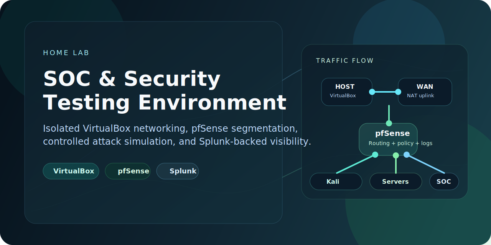
</p>

<p align="center">
  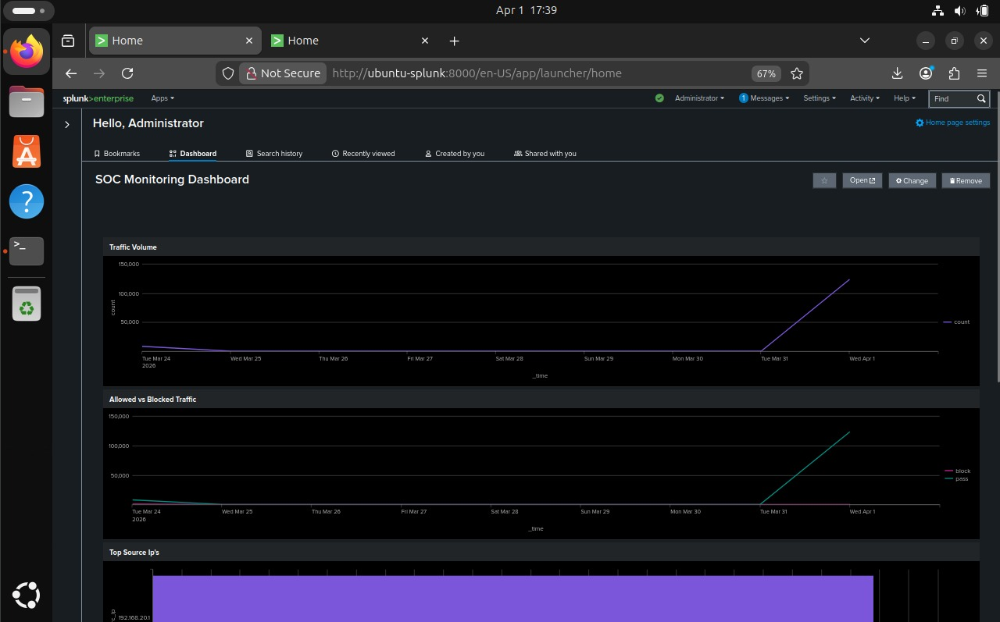
</p>

> A blue-team-focused home lab where all systems sit behind `pfSense`, vulnerable workloads stay contained, and security activity can be searched, graphed, and investigated in `Splunk`.

## Overview

This lab was built to safely practice security operations in an environment that feels closer to a real network than a flat collection of virtual machines. The design centers on isolation, segmentation, and visibility: VirtualBox provides the virtualization layer, `pfSense` controls routing and security policy, and `Splunk` acts as the central point for log collection and analysis.

Inside the lab, I used tools such as `Nmap`, `OpenVAS`, `Metasploit`, `Hydra`, `Burp Suite`, `Wireshark`, `John the Ripper`, and `Scapy` to generate controlled test activity and study how that activity looked from a defensive point of view.

### Why This Project Stands Out

- Segmented the lab into dedicated `LAN`, `SERVER_NET`, and `WORKSTATION_NET` zones behind a central firewall
- Routed telemetry from `pfSense` into `Splunk` to simulate a small SOC monitoring workflow
- Validated the environment with real scans, connectivity checks, and log review instead of static screenshots alone
- Practiced both offensive tooling and defensive interpretation inside a contained environment

## Lab Snapshot

| Area | Details |
| --- | --- |
| Primary goal | Build an isolated lab for security testing and SOC-style monitoring |
| Edge connectivity | `VirtualBox NAT` -> `pfSense WAN` |
| Segmentation model | Dedicated internal networks behind `pfSense` to simulate VLAN-style segmentation |
| Internal networks | `LAN 192.168.10.0/24`, `SERVER_NET 192.168.20.0/24`, `WORKSTATION_NET 192.168.30.0/24` |
| Core services | `pfSense`, `Splunk`, `Kali Linux`, `Windows Server 2022`, `Metasploitable2` |
| Telemetry path | `pfSense` syslog forwarded into `Splunk` over `UDP/1514` |
| Validation traffic | ICMP tests, `Nmap` scans, web traffic, service discovery, and firewall log review |

## Architecture

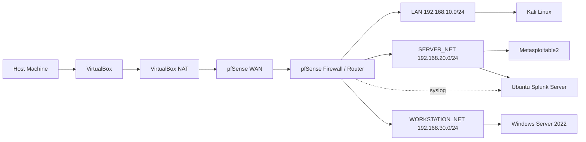

## Segmentation and Controls

| Control | Implementation | Why it matters |
| --- | --- | --- |
| Host isolation | VirtualBox internal networks plus a NAT-backed WAN | Keeps the lab separated from the host and home network |
| Central gateway | `pfSense` is the only path between networks and the internet | Makes traffic visible and policy-driven |
| Internal segmentation | Separate interfaces for `LAN`, `SERVER_NET`, and `WORKSTATION_NET` | Simulates trust boundaries and limits unrestricted east-west traffic |
| DHCP and ICMP | Enabled where needed for address assignment and troubleshooting | Speeds up validation and recovery |
| Log collection | `pfSense` events forwarded to `Splunk` | Creates a SOC-style data source for searches and dashboards |
| Vulnerable host containment | Intentionally vulnerable systems remain behind `pfSense` | Supports safe offensive testing inside the lab |

## Visual Walkthrough

<table>
  <tr>
    <td align="center" width="50%">
      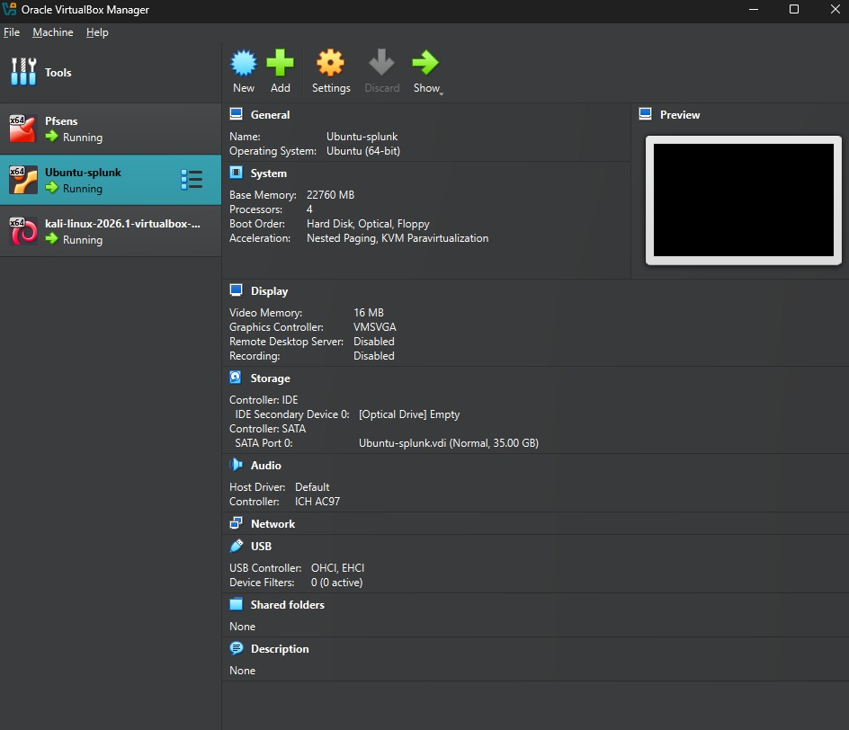
      <br />
      <sub>VirtualBox running the core lab machines</sub>
    </td>
    <td align="center" width="50%">
      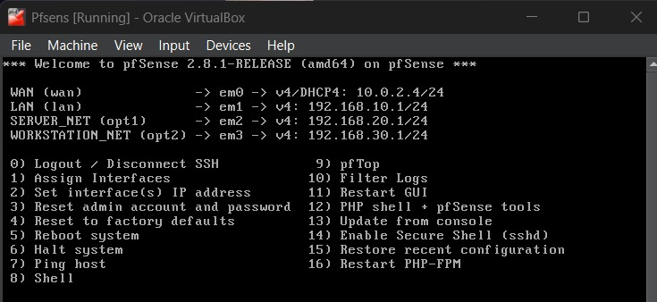
      <br />
      <sub>pfSense interface map and IP assignments</sub>
    </td>
  </tr>
  <tr>
    <td align="center" width="50%">
      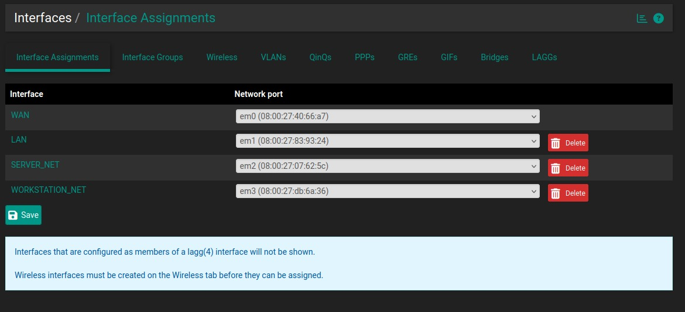
      <br />
      <sub>Interface-based segmentation inside pfSense</sub>
    </td>
    <td align="center" width="50%">
      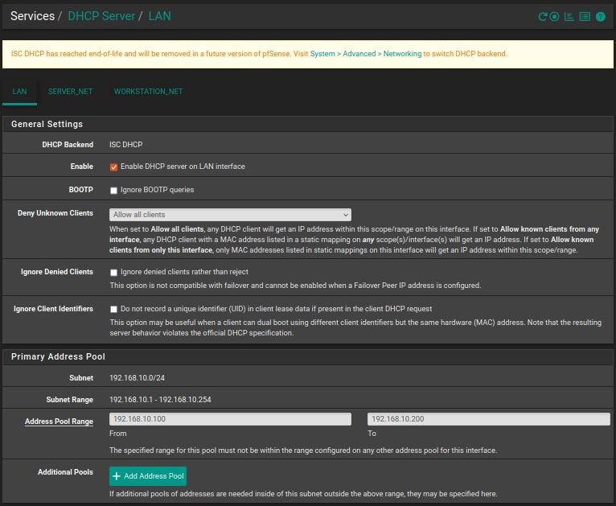
      <br />
      <sub>DHCP services used to provision internal hosts</sub>
    </td>
  </tr>
  <tr>
    <td align="center" width="50%">
      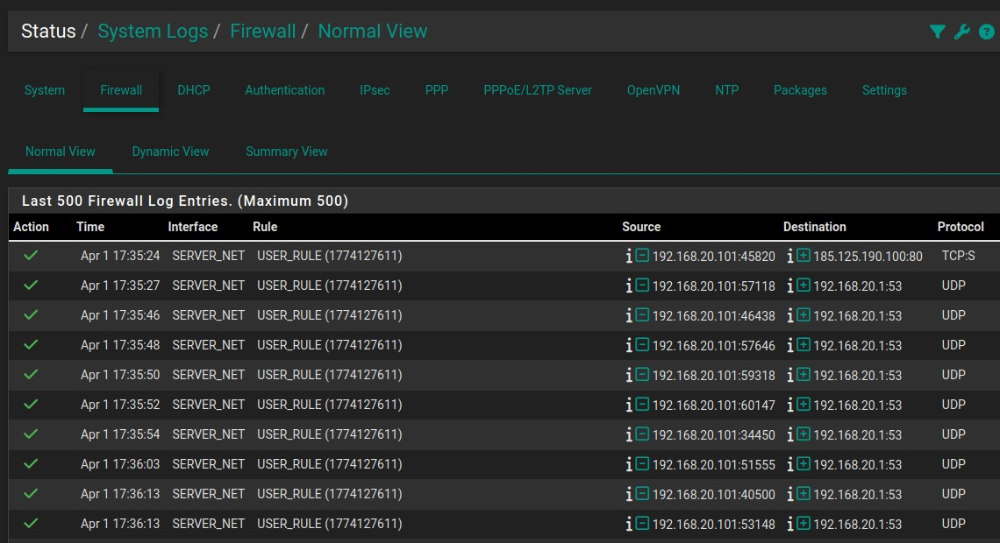
      <br />
      <sub>Firewall events captured at the gateway</sub>
    </td>
    <td align="center" width="50%">
      
      <br />
      <sub>Splunk dashboard built from ingested lab telemetry</sub>
    </td>
  </tr>
  <tr>
    <td align="center" width="50%">
      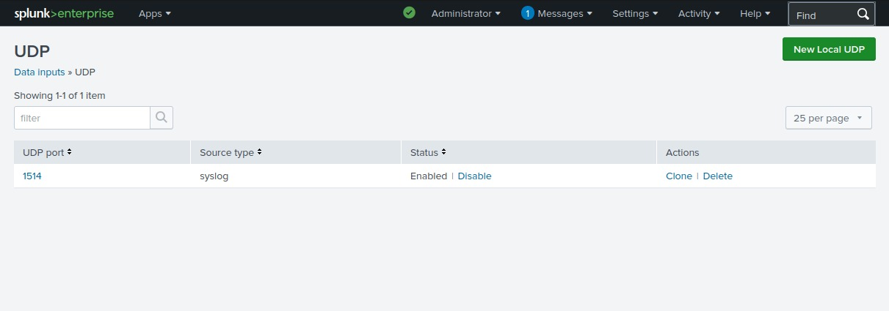
      <br />
      <sub>Syslog listener configured on UDP/1514</sub>
    </td>
    <td align="center" width="50%">
      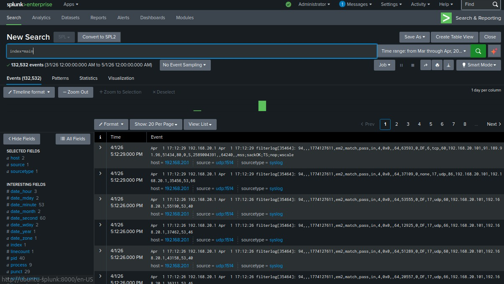
      <br />
      <sub>Raw searchable events from pfSense in Splunk</sub>
    </td>
  </tr>
  <tr>
    <td align="center" width="50%">
      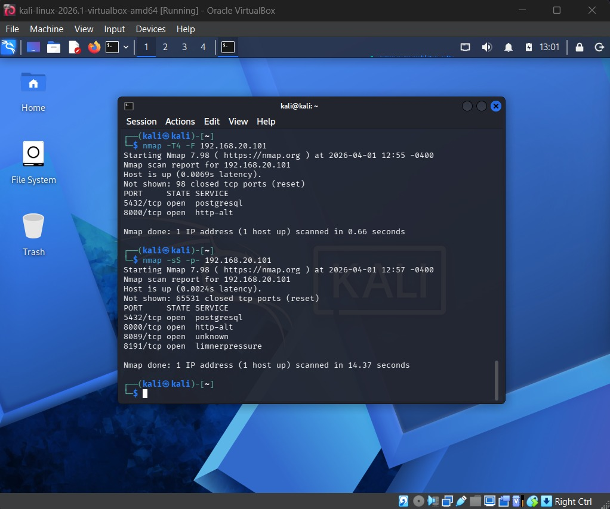
      <br />
      <sub>Kali generating controlled scan traffic inside the lab</sub>
    </td>
    <td align="center" width="50%">
      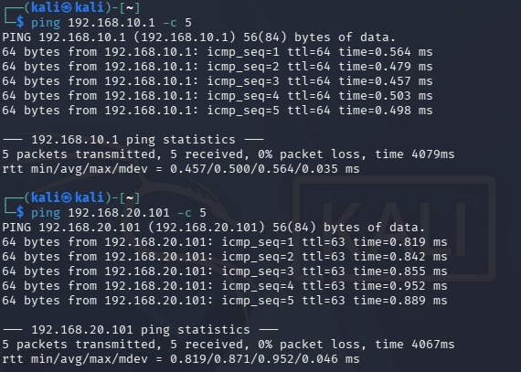
      <br />
      <sub>Connectivity validation between permitted systems</sub>
    </td>
  </tr>
</table>

<details>
  <summary><strong>Additional configuration screenshots</strong></summary>
  <br />
  <table>
    <tr>
      <td align="center" width="50%">
        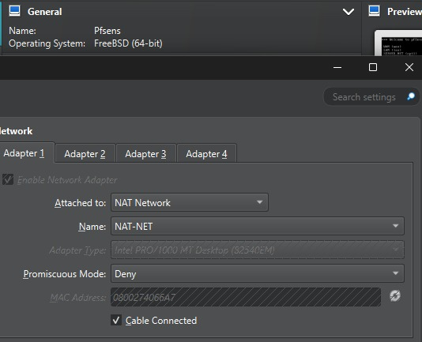
        <br />
        <sub>WAN adapter attached to VirtualBox NAT</sub>
      </td>
      <td align="center" width="50%">
        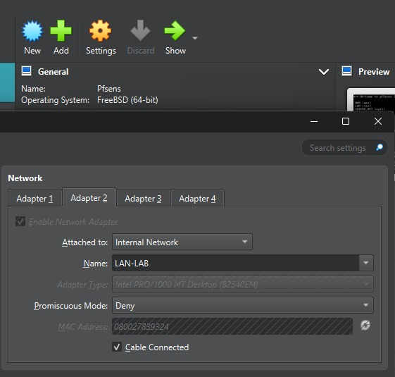
        <br />
        <sub>Internal LAN adapter</sub>
      </td>
    </tr>
    <tr>
      <td align="center" width="50%">
        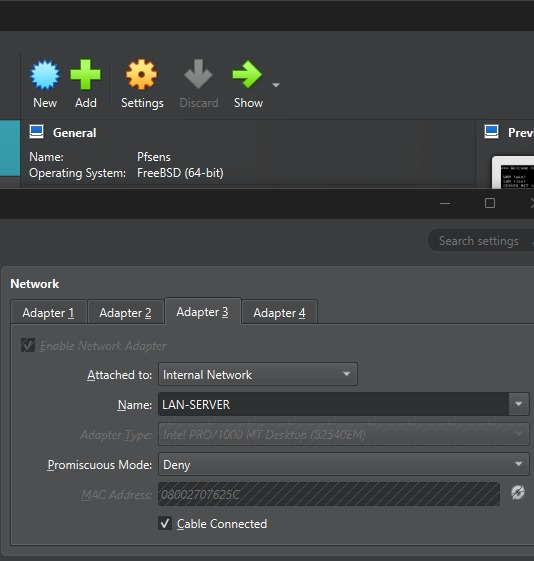
        <br />
        <sub>SERVER_NET adapter</sub>
      </td>
      <td align="center" width="50%">
        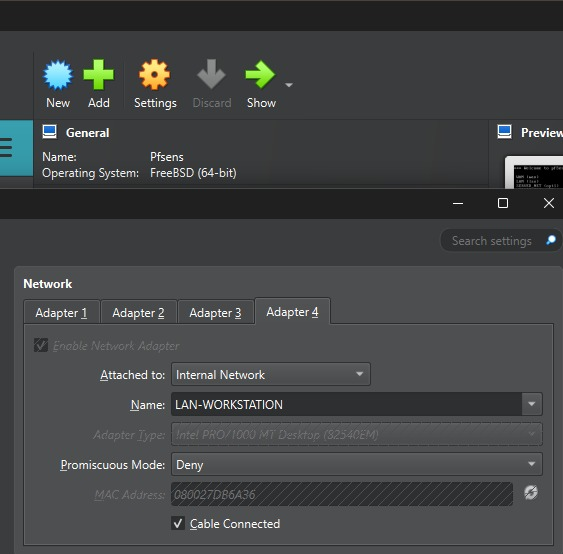
        <br />
        <sub>WORKSTATION_NET adapter</sub>
      </td>
    </tr>
    <tr>
      <td align="center" width="50%">
        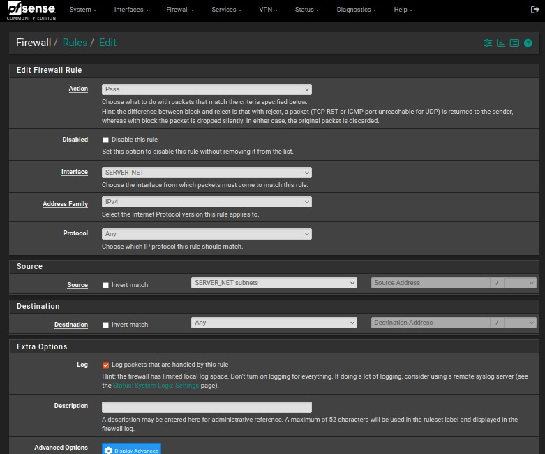
        <br />
        <sub>Representative pfSense rule configuration for SERVER_NET</sub>
      </td>
      <td align="center" width="50%">
        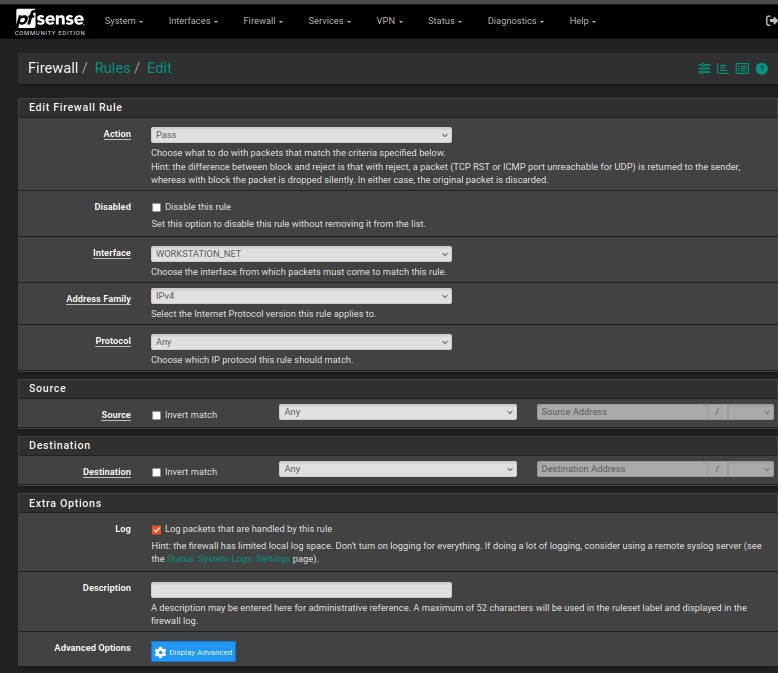
        <br />
        <sub>Representative pfSense rule configuration for WORKSTATION_NET</sub>
      </td>
    </tr>
    <tr>
      <td align="center" width="50%">
        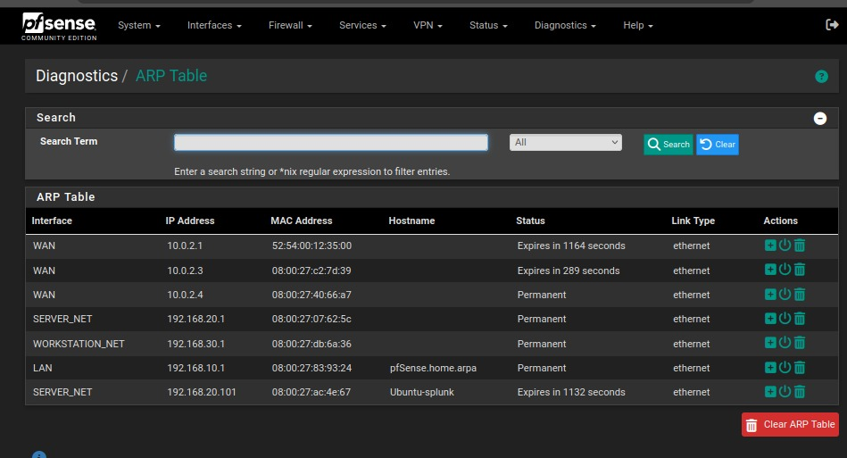
        <br />
        <sub>ARP visibility across active interfaces and hosts</sub>
      </td>
      <td align="center" width="50%">
        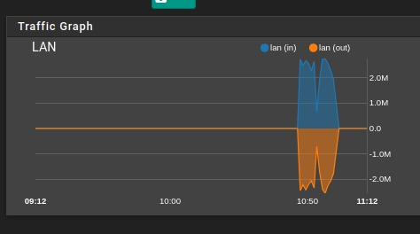
        <br />
        <sub>Traffic spike observed during `Nmap` testing</sub>
      </td>
    </tr>
  </table>
</details>

## Detection Workflow

1. Test traffic originates from lab systems such as `Kali`, Windows, or intentionally vulnerable targets.
2. `pfSense` routes, filters, and logs that activity at the network boundary between segments.
3. `pfSense` forwards syslog data into `Splunk` on `UDP/1514`.
4. `Splunk` provides both a dashboard view and raw event search for analysis and correlation.
5. Packet-level and endpoint-level observations can be compared against firewall and SIEM telemetry.

## Tools and Exercises

| Tool | How it was used | What I learned |
| --- | --- | --- |
| `Nmap` | Host discovery, service enumeration, SYN scans, and OS detection | How active scanning appears in firewall logs and packet captures |
| `OpenVAS / Greenbone` | Authenticated and unauthenticated vulnerability scans against lab systems | How to interpret service exposure, CVSS scores, and vulnerability prioritization |
| `Metasploit` | Controlled exploitation and service checks against intentionally vulnerable hosts | How exploit activity and service misuse can create detectable signals |
| `Hydra` | Credential testing across protocols such as `SSH`, `FTP`, `SMB`, `RDP`, and HTTP forms | How repeated login attempts show up in endpoint and SIEM telemetry |
| `Burp Suite` | Web interception, request replay, input testing, and response comparison | How suspicious web traffic and form abuse can be observed and reasoned about |
| `Wireshark` | Packet capture for `SYN`, `DNS`, `HTTP`, `SMB`, and authentication traffic | How logs and packets complement each other during investigations |
| `John the Ripper` | Offline password cracking and hash analysis | Why offline attacks are often invisible on the network and depend on prior credential exposure |
| `Scapy` | Custom packet crafting and ARP-based discovery | How low-level traffic can be used to build asset inventories and test assumptions |

## Bring-Up Sequence

1. Start `pfSense` first so routing, DHCP, and firewall policy are available.
2. Start `Splunk` so logs are collected from the beginning of the session.
3. Start target systems such as `Windows Server 2022` and `Metasploitable2`.
4. Start `Kali Linux` and run connectivity checks before any scanning or testing.
5. Confirm DHCP leases, successful ICMP where allowed, and live event ingestion in `Splunk`.

## Repository Structure

```text
.
├── GITHUB_COPY.md
├── README.md
└── assets
    ├── branding
    └── screenshots
```

## Key Outcomes

- Built a segmented, isolated lab that stays off the host and home network.
- Used `pfSense` as both a security control and a valuable log source.
- Centralized telemetry in `Splunk` for dashboarding and raw-event analysis.
- Practiced offensive tooling in a controlled environment with a defensive lens.
- Reinforced the value of packet captures, firewall logs, and SIEM correlation working together.

## Responsible Use

This repository documents authorized testing performed inside an isolated personal environment. All scanning, credential testing, and exploitation exercises were limited to lab-owned systems for educational and defensive learning purposes.
