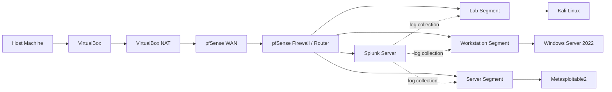

# HomeLab SOC & Security Testing Environment

This project documents a self-contained cyber security home lab built to safely practice network defense, vulnerability assessment, traffic analysis, and SIEM monitoring. The lab was designed to stay isolated from the host machine and wider home network while still allowing controlled internet access when required.

The environment uses VirtualBox networking, `pfSense` for segmentation and traffic control, multiple VLAN-style lab segments, and `Splunk` for centralized log collection. Within that environment, I practiced host discovery, service enumeration, vulnerability scanning, credential attack detection, packet analysis, and log correlation.

## Objectives

- Keep the lab isolated from the host and home network.
- Simulate segmented enterprise-style networking.
- Route traffic through `pfSense` for visibility and control.
- Generate realistic logs for SIEM-style analysis in `Splunk`.
- Practice offensive tooling in a contained environment to better understand detection opportunities.

## Lab Architecture

- `VirtualBox Host-Only` networking was used to keep the lab separated from the host machine and main network.
- `VirtualBox NAT` provided controlled outbound internet access through `pfSense` when needed.
- `pfSense` acted as the central firewall and gateway for all lab segments.
- VLAN-style segmentation was used to separate lab systems into different trust zones such as:
  - Lab segment
  - Workstation segment
  - Server segment

All virtual machines, including Windows, Kali, Metasploitable2, and Splunk, lived behind `pfSense` on internal LAN segments. The WAN side of `pfSense` connected to VirtualBox NAT so the lab could reach the internet in a controlled way without exposing vulnerable machines directly.

## Core Security Controls

`pfSense` was used for network segmentation, controlled internet access, and as a realistic security telemetry source for the lab.

Key rules and behaviors included:

- Allowing `DHCP` traffic so `pfSense` could assign IP addresses to lab systems.
- Allowing internal `ICMP` ping for connectivity checks and troubleshooting.
- Allowing `Splunk` to reach hosts across segments for centralized log collection.
- Allowing outbound internet access only when necessary for updates or testing.
- Blocking `Metasploitable2` from reaching the internet so intentionally vulnerable services stayed contained.

This design allowed me to observe both permitted and blocked traffic in firewall logs while keeping the environment safe.

## Systems in the Lab

- `pfSense` firewall/router
- `Splunk` for log collection and SIEM-style visibility
- `Kali Linux` for security testing
- `Windows Server 2022`
- `Metasploitable2`
- Additional Linux hosts for scanning and validation

## Tooling and What I Practiced

### Splunk

I used `Splunk` to collect logs from endpoints and infrastructure so I could simulate SIEM workflows. The goal was to observe how scans, login attempts, firewall activity, and web testing appeared across different data sources.

Examples of telemetry I reviewed:

- Firewall events from `pfSense`
- Authentication activity from Windows systems
- Scan-related traffic
- Web request patterns
- Credential attack attempts

### pfSense

`pfSense` was the foundation of the lab. It provided:

- Network segmentation
- A controlled path to the internet
- Containment for vulnerable virtual machines
- Firewall logs that served as a SOC-relevant data source

I used it to observe blocked scans, ICMP traffic, and cross-segment communication.

### Nmap

I used `Nmap` for host discovery, service discovery, and controlled scan activity inside the lab. This helped me map the environment, identify exposed services, and compare what I saw from the scanner with what `pfSense`, `Splunk`, and `Wireshark` recorded.

Concepts practiced:

- Host discovery
- Service enumeration
- SYN scanning
- OS fingerprinting
- Scan visibility in firewall and packet-capture tools

### OpenVAS / Greenbone

I used `OpenVAS` to perform vulnerability assessments against lab systems.

Use cases included:

- Unauthenticated scans against `Metasploitable2`
- Authenticated scanning against `Windows Server 2022`
- Reviewing vulnerability severity through `CVSS` scoring and risk metrics
- Exporting vulnerability results into `Splunk` for correlation

Findings from `Metasploitable2` included exposed and outdated services such as:

- `OpenSSH`
- Outdated `Apache`
- Vulnerable `Tomcat`

This helped me better understand how outdated services expand attack surface and how vulnerability scan results can be prioritized.

### Metasploit

I used `Metasploit` inside the isolated lab to understand how vulnerable services can be identified and how exploit activity generates security telemetry.

Lab exercises included:

- Testing known vulnerable FTP services
- Checking HTTP service versions
- Assessing weak or default web application credentials
- Comparing SMB exposure between modern Windows systems and intentionally vulnerable hosts

The focus was not only exploitation, but also understanding what those actions looked like from a defender's perspective in logs and network traces.

### Hydra

I used `Hydra` to study weak credential exposure and brute-force detection across several protocols.

Protocols explored:

- `SSH`
- `FTP`
- `SMB`
- `RDP`
- HTTP form authentication

This helped me understand:

- The difference between single-user and multi-user password testing
- The impact of thread count on attack speed
- How repeated login attempts appear in endpoint and SIEM logs
- Why account lockout and monitoring matter

### Burp Suite

I used `Burp Suite` to test web applications hosted in the lab.

Areas practiced:

- Intercepting and modifying HTTP/S requests
- Replaying requests in `Repeater`
- Fuzzing parameters and login inputs
- Observing differences in server responses such as `200`, `403`, and `500`
- Studying how login attempts and malformed requests appeared in `Splunk`

This helped me better understand input validation issues, web request flows, and detection opportunities around suspicious web traffic.

### Wireshark

I used `Wireshark` to capture and inspect live packet traffic generated by my lab tools.

Traffic analyzed included:

- `Nmap` SYN scan behavior
- HTTP `POST` requests from a demo login page
- `DNS` queries generated by scripts
- `SMB` and `NTLM` authentication traffic from Windows testing

This gave me packet-level visibility into how scans, authentication attempts, and application traffic actually moved through the network.

### John the Ripper

I used `John the Ripper` to study password security and offline hash cracking.

Concepts practiced:

- Password hash analysis
- Cracking `NTLM` hashes
- Working with password material from vulnerable Linux systems
- Understanding the difference between online attacks and offline cracking

One key lesson was that offline cracking does not generate the same network visibility as online attacks. Detection depends much more on preventing, monitoring, and responding to credential or hash leakage upstream.

### Scapy

I used `Scapy` to build custom packet workflows, especially for host discovery using `ARP`.

This was useful because:

- `ARP` discovery is fast on local networks
- It still works when `ICMP` ping is blocked
- It helped me build accurate host inventories for `Splunk` dashboards

It also reinforced an important networking concept: `ARP` is not routed like IP traffic, so it is not filtered in the same way by traditional firewall rules.

## Example Lab Activities

Across the environment, I practiced:

- Discovering hosts and services across lab subnets
- Scanning systems for vulnerabilities
- Comparing authenticated and unauthenticated scan results
- Generating firewall, authentication, and web logs for SIEM analysis
- Studying packet captures for scans and login attempts
- Validating how weak credentials and exposed services create risk
- Observing the difference between detectable online attacks and lower-visibility offline cracking workflows

## Key Takeaways

- Segmentation and containment matter, especially when working with intentionally vulnerable systems.
- `pfSense` provided both security control and valuable telemetry.
- `Splunk` helped connect network activity, host logs, and vulnerability data into a more SOC-like workflow.
- Vulnerability scanning becomes more useful when paired with severity analysis and centralized logging.
- Offensive tools are also powerful defensive learning tools when used in a contained lab and analyzed from the blue-team perspective.
- Packet capture adds important context that logs alone may miss.

## Responsible Use

This lab was built for authorized testing and education only. All tools and techniques were used inside an isolated personal environment designed to prevent unintended interaction with external systems or the home network.

## Summary

This home lab gave me hands-on practice across network security, vulnerability management, SIEM monitoring, packet analysis, and security testing. By combining `pfSense`, segmented virtual networks, vulnerable lab targets, and centralized logging in `Splunk`, I was able to build a safe environment that simulated both attacker behavior and defender visibility.
